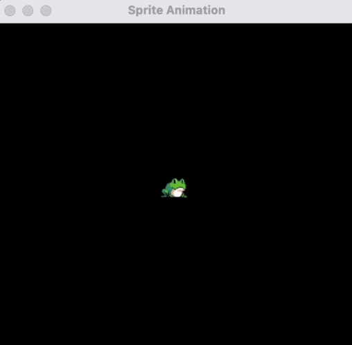

# Animated Sprite in Pygame 

An animated sprite in Pygame is a graphical object that represents a character, object, or element in a game with multiple frames of animation. This sprite typically consists of a series of images (frames) that depict various stages of motion, such as walking, jumping, or attacking.

### Animation

